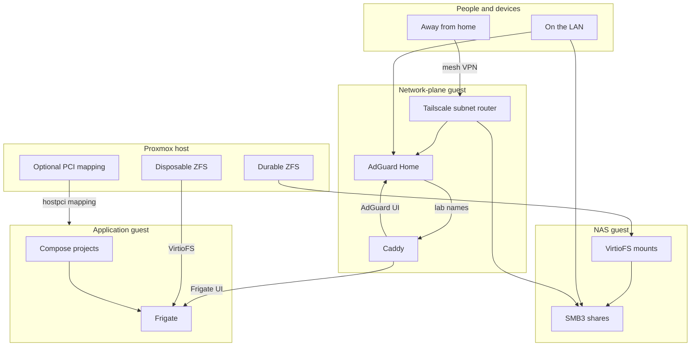
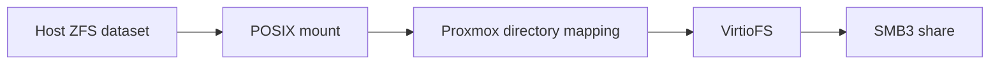
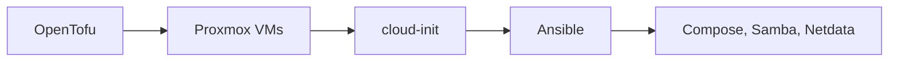

# homelab

Public, versioned implementation of a household homelab. This repository holds
the reusable OpenTofu modules, Ansible collection, application templates,
fictional examples, CI, and architecture documentation.

It is meant to be **read** as a portfolio of how the lab is organized, and
**used** by a separate private repository that deploys a real site. This
repository never depends on that private companion and never contains real
addresses, hostnames, hardware mappings, credentials, or an apply workflow.

See [Public implementation and private deployment](docs/public-private-separation.md)
for the repo split and how a site consumes this code. The diagram below is the
**running system**, not the git workflow.

## Architecture

Three guests on one Proxmox host. The network-plane guest is the only place for
DNS, HTTPS names, and remote access. The NAS guest is a replaceable SMB front
end. The application guest runs Compose workloads such as Frigate. ZFS stays
on the hypervisor, so destroying a guest does not destroy host datasets.



How traffic and data move:

- LAN DHCP points at AdGuard. AdGuard filters ads and answers lab names.
  Caddy terminates TLS and proxies to services. AdGuard stays on the
  network-plane guest; Frigate and later apps run on the application guest
  and receive names the same way.
- Tailscale on that guest advertises the LAN. Remote devices join the tailnet
  and reach DNS and SMB without a second exposure path. Cloudflare is used
  for DNS-01 certificates, not as a public reverse proxy for the LAN.
- Personal and media datasets live on host ZFS. Proxmox maps those directories
  into the NAS guest with VirtioFS. Samba exports SMB3. Disposable camera
  footage is mapped into the application guest, not exported over SMB.



Provisioning is a pipeline, not a second control plane:



OpenTofu creates guests. cloud-init gets SSH and networking. Ansible configures
the OS and renders application config from site inputs. Merge-and-apply details
stay in the private site repository.

## What this repository ships

`modules/proxmox-vm` provisions one Proxmox cloud-init VM through
`bpg/proxmox` 0.111.1. `modules/proxmox-guests` composes a stable map of
those guests from private site configuration and can attach VirtioFS
directory mappings and optional PCI resource mappings. Fictional usage is
under `examples/`. Collection `herickmotta.homelab` 0.6.0 ships
`guest_base`, `network_plane`, `application_runtime`, `frigate`,
`proxmox_host_power`, `proxmox_host_storage`, `nas_server`, and
`netdata_agent`. Site repositories pin a full commit SHA, not a moving tag;
`v0.1.0` is the earlier single-VM module only.

The collection owns the Ubuntu guest baseline and the complete network-plane
implementation: AdGuard Home, Caddy with Cloudflare DNS-01, and Tailscale
subnet routing. Its roles render the final Compose and application
configuration from typed site inputs; consumers do not copy those files.

QEMU guest agent: `modules/proxmox-vm` sets `agent.enabled = true` and
expects cloud-init vendor-data at
`local:snippets/qemu-guest-agent.yaml`. Copy
[`modules/proxmox-vm/cloud-init/vendor-data.yaml`](modules/proxmox-vm/cloud-init/vendor-data.yaml)
onto the node. Snippet upload through the provider needs SSH to Proxmox; the
module stays API-only, so this is a one-time host step.

## What belongs here

This repository may contain reusable and composition-level OpenTofu modules,
the public Ansible collection, application templates, fictional reference
configuration, CI, and public architecture notes.

It must **not** contain:

- real private IP addresses or internal hostnames
- credentials, encrypted production secrets, or private keys
- private network topology, hardware mappings, or environment identifiers
- OpenTofu state, raw plans, apply logs, or a live deployment workflow

## Layout

```
modules/     reusable and composable OpenTofu modules
ansible/     herickmotta.homelab collection, roles, and templates
examples/    fictional example roots and a site configuration shape
docs/        architecture and public/private boundary
.github/     public validation only; never live apply
```

The stack is OpenTofu → Proxmox → cloud-init → Ansible → Docker Compose.
Kubernetes remains deferred until a concrete workload requires it. Host-owned
ZFS and the replaceable NAS VM are described in
[Persistent storage and NAS serving](docs/persistent-storage.md).

## Using this for a real site

Create a **private site repository**. It should stay small: pin one commit
from this repository, declare real topology, encrypt secrets, and own apply.

A typical layout:

```
site.yaml      real topology, sizing, and non-secret inputs
tofu/          backend/provider binding and pinned module call
ansible/       collection pin, inventory, and role invocation
secrets/       SOPS-encrypted credentials only
```

Pin a reviewed full commit SHA in the private OpenTofu root:

```hcl
module "guests" {
  # Keep this SHA aligned with ansible/requirements.yml in the site repo.
  source = "git::https://github.com/herickmotta/homelab.git//modules/proxmox-guests?ref=<full-commit-sha>"

  # Site values are decoded from the private site.yaml and passed as inputs.
}
```

Install the Ansible collection from the same commit:

```yaml
collections:
  - name: https://github.com/herickmotta/homelab.git
    type: git
    version: <full-commit-sha>
```

The reference shape is
[`examples/site.example.yaml`](examples/site.example.yaml). Copy that shape,
replace fictional values, and keep secrets out of `site.yaml`.

A public change never deploys a site. Promotion is a private PR that updates
both pins to the same SHA and reviews a real OpenTofu plan.

## Validation

CI runs OpenTofu `fmt`/`validate`, `ansible-lint`, and an Ansible
collection build. It uses only fictional example values and cannot reach or
deploy a live environment.

Locally:

- `tofu fmt -check -recursive`
- `tofu validate` in each example root
- `ansible-lint ansible`
- `ansible-galaxy collection build ansible`

See [AGENTS.md](AGENTS.md) for repository boundaries, workflow, and safety
rules.
